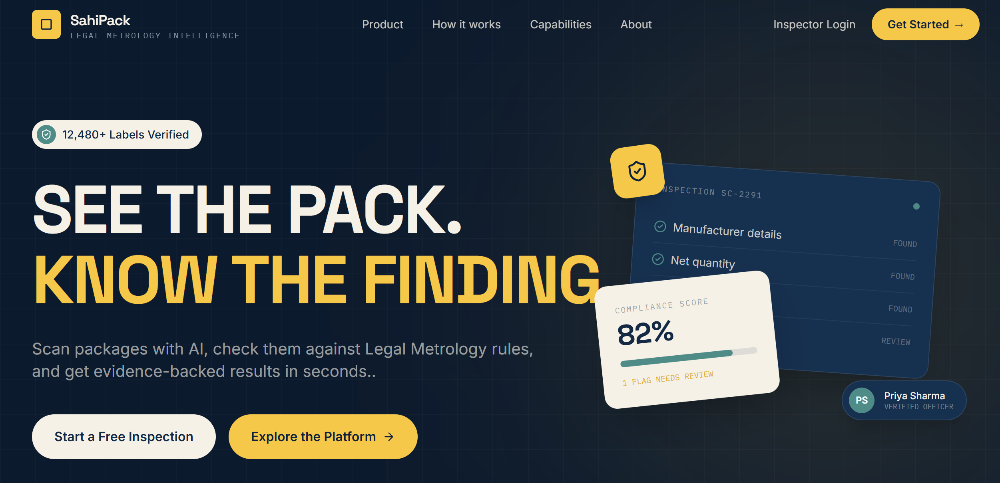
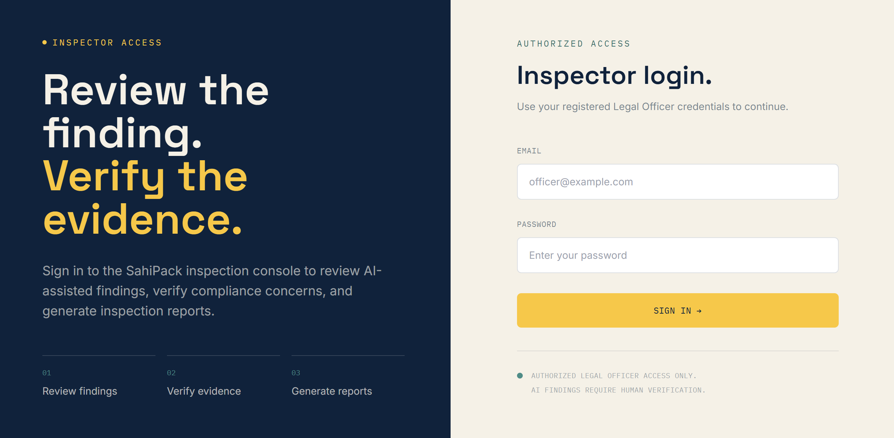
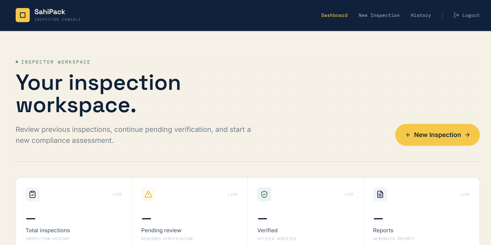
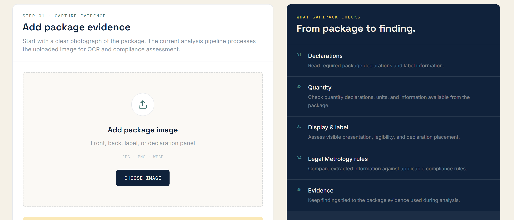
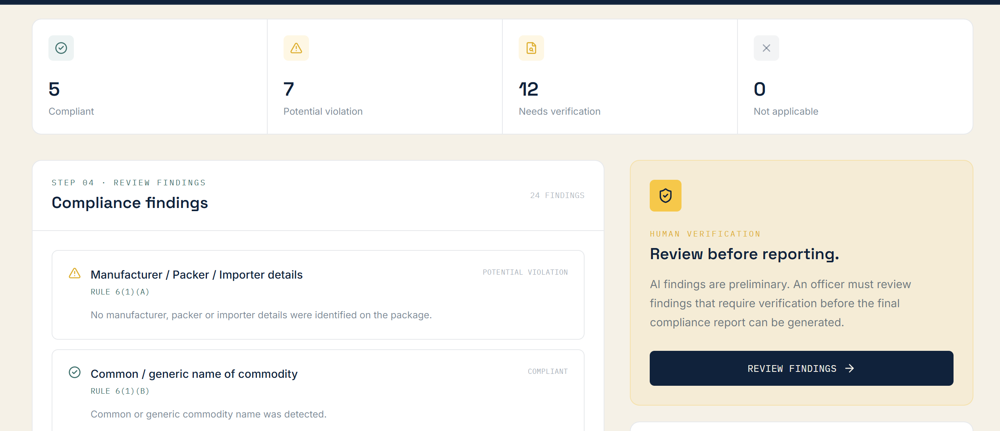
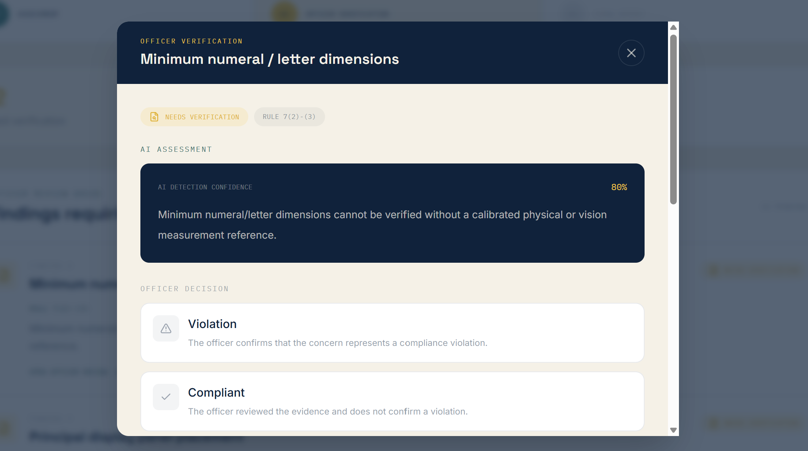
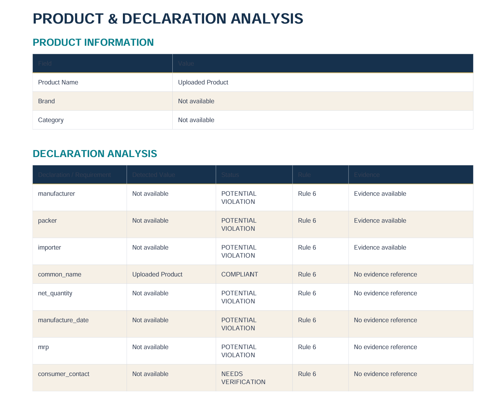

<p align="center">
  
</p>

<p align="center">
  <strong>See the pack. Know the finding.</strong>
</p>
# SahiPack --- Legal Metrology Intelligence

> **AI-assisted packaged commodity compliance screening for Legal
> Metrology inspections.**

SahiPack is a web-based inspection support system designed to help Legal
Metrology officers screen packaged commodities against applicable
declaration and packaging requirements under the **Legal Metrology
(Packaged Commodities) Rules, 2011**.

The platform combines package-image OCR, structured declaration
extraction, a rule-driven compliance engine, evidence-backed findings,
human officer verification, and digital report generation into one
inspection workflow.

> **Important:** SahiPack is an AI-assisted screening and
> inspection-support system. It does not independently make a final
> legal determination. Findings that require physical inspection or
> officer judgement are routed for human verification.

------------------------------------------------------------------------

## Table of Contents

-   [Problem](#problem)
-   [Solution](#solution)
-   [Key Features](#key-features)
-   [Users](#users)
-   [End-to-End Workflow](#end-to-end-workflow)
-   [System Architecture](#system-architecture)
-   [Compliance Assessment Model](#compliance-assessment-model)
-   [Officer Verification](#officer-verification)
-   [Reports](#reports)
-   [Technology Stack](#technology-stack)
-   [Project Structure](#project-structure)
-   [Running Locally](#running-locally)
-   [Environment Variables](#environment-variables)
-   [API Overview](#api-overview)
-   [Screenshots](#screenshots)
-   [Project Demonstration](#project-demonstration)
-   [Limitations and Safeguards](#limitations-and-safeguards)
-   [Future Scope](#future-scope)
-   [SIH Context](#sih-context)
-   [License](#license)

------------------------------------------------------------------------

## Problem

Packaged commodities carry multiple mandatory declarations and packaging
requirements. During an inspection, an officer may need to inspect
package labels, identify manufacturer/packer/importer information, check
consumer-care information, examine net quantity and units, compare
extracted information against applicable Legal Metrology requirements,
document evidence, and prepare an inspection report.

A manual workflow can require repeatedly reading labels, comparing
information with rules, recording findings, collecting evidence, and
preparing reports.

SahiPack brings these activities into a single digital inspection
workflow.

------------------------------------------------------------------------

## Solution

SahiPack follows a **human-in-the-loop compliance workflow**:

``` text
Package Images
      │
      ▼
Image Processing + OCR
      │
      ▼
Structured Declarations
      │
      ▼
Applicability + Rule Engine
      │
      ▼
Initial AI Assessment
      │
      ├── Compliant
      ├── Potential Violation
      ├── Not Applicable
      │
      └── Needs Verification
                │
                ▼
        Officer Verification
                │
        ┌───────┼────────┐
        ▼       ▼        ▼
    Violation Compliant Needs Verification
                │
                ▼
       Optional Comment
       Optional Evidence
                │
                ▼
       Finalize Inspection
                │
                ▼
          PDF / DOCX
```

------------------------------------------------------------------------

## Key Features

### Package Image Scanning

Officers can upload package images and use them as inspection evidence.

### OCR-Assisted Declaration Extraction

The OCR pipeline preprocesses images and extracts visible label text,
which is then converted into structured declaration information.

### Rule-Driven Compliance Engine

Extracted information is evaluated against structured Legal Metrology
rules and validators rather than relying on an unrestricted AI response.

### Applicability-Aware Assessment

Rules are evaluated with applicability and exception conditions in mind.

### Human-in-the-Loop Verification

Only findings marked **Needs Verification** enter the officer review
queue. Compliant results do not require unnecessary manual confirmation.

For each review item, the officer can select:

-   **Violation**
-   **Compliant**
-   **Needs Verification**

The officer may also add an optional comment and photographic evidence.

### Evidence-Backed Findings

Findings remain linked to package evidence and officer-added evidence.

### Final Inspection Comment

Before finalizing an inspection, the officer can record an overall
comment for issues missed, incorrectly assessed, or not fully captured
by the automated assessment.

### Officer-Verified Reports

Once required verification is complete, the inspection can be exported
as:

-   PDF
-   Editable DOCX

### Inspection History

Completed inspections and their reports can be retained for later
review.

### Authentication

The backend provides authenticated Legal Officer access using
token-based authentication.

------------------------------------------------------------------------

## Users

### Legal Officer

The primary user can:

1.  Log in.
2.  Start a new inspection.
3.  Upload package evidence.
4.  Run compliance analysis.
5.  Review findings requiring verification.
6.  Record officer decisions.
7.  Add optional comments and photographs.
8.  Add a final inspection comment.
9.  Finalize the inspection.
10. Generate PDF/DOCX reports.
11. Review inspection history.

------------------------------------------------------------------------

## End-to-End Workflow

### 1. Login

``` text
Public Website → Inspector Login → Inspector Dashboard
```

### 2. Capture

The officer starts a new inspection and uploads package evidence.

### 3. Read

``` text
Image
 ↓
OpenCV preprocessing
 ↓
Tesseract OCR
 ↓
Extracted label text
 ↓
Structured declarations
```

### 4. Check

The rule engine determines applicable requirements and runs validators.

### 5. Initial Assessment

The system produces findings using statuses such as:

  -----------------------------------------------------------------------
  Status                              Meaning
  ----------------------------------- -----------------------------------
  `COMPLIANT`                         Available evidence supports
                                      compliance for the evaluated
                                      requirement.

  `POTENTIAL_VIOLATION`               Available evidence indicates a
                                      potential issue.

  `NEEDS_VERIFICATION`                Digital evidence is insufficient
                                      and officer/physical verification
                                      is required.

  `NOT_APPLICABLE`                    The requirement does not apply to
                                      the evaluated condition.
  -----------------------------------------------------------------------

### 6. Officer Verification

Only `NEEDS_VERIFICATION` findings are placed in the review queue.

``` text
AI Finding
   ↓
Officer Review
   ├── Violation
   ├── Compliant
   └── Needs Verification
          ↓
   Optional comment
          +
   Optional photographs
```

### 7. Finalize

After required findings are reviewed, the officer can finalize the
inspection and add a final inspection-level comment.

### 8. Report

``` text
Finalized Inspection
        ↓
Officer-Verified Report
        ├── PDF
        └── DOCX
```

------------------------------------------------------------------------

## System Architecture

``` text
┌───────────────────────────────────────────────┐
│                 SahiPack Web UI               │
│                  React / Vite                 │
│                                               │
│ Home → Login → Dashboard → Inspection         │
│                    ↓                          │
│             Officer Verification              │
│                    ↓                          │
│                 Final Report                  │
└──────────────────────┬────────────────────────┘
                       │ REST API
                       ▼
┌───────────────────────────────────────────────┐
│                FastAPI Backend                │
│                                               │
│ Authentication | Scans | Inspections          │
│ Dashboard | Rule Engine | Reports             │
└───────────┬───────────────────────┬───────────┘
            │                       │
            ▼                       ▼
┌─────────────────────┐   ┌─────────────────────┐
│    OCR Pipeline     │   │   Rule Engine       │
│ OpenCV              │   │ JSON-driven rules   │
│ Tesseract           │   │ Validators          │
│ Pillow              │   │ Assessment logic    │
└─────────────────────┘   └─────────────────────┘
            │                       │
            └───────────┬───────────┘
                        ▼
              ┌───────────────────┐
              │    PostgreSQL     │
              │ Users             │
              │ Products          │
              │ Inspections       │
              │ Findings          │
              │ Evidence          │
              │ Reports           │
              └───────────────────┘
```

------------------------------------------------------------------------

## Compliance Assessment Model

SahiPack separates automated screening from officer verification.

### Automated layer

The automated layer can:

-   read package text;
-   structure extracted declarations;
-   identify applicable rules;
-   run deterministic validators;
-   generate findings;
-   preserve supporting evidence;
-   provide AI detection confidence where applicable.

### Human layer

The officer reviews findings that cannot be reliably resolved from
available digital evidence.

For example, actual net quantity and Maximum Permissible Error may
require physical testing rather than image analysis.

------------------------------------------------------------------------

## Officer Verification

The verification interface is intentionally focused on findings
requiring human review.

``` text
OFFICER DECISION

[ VIOLATION ]

[ COMPLIANT ]

[ NEEDS VERIFICATION ]

OFFICER COMMENT
Optional

PHOTO EVIDENCE
Optional
```

Officer comments are not mandatory for every finding.

Officer photographs can be attached as additional inspection evidence
and included in the final report.

------------------------------------------------------------------------

## Reports

The officer-verified report can contain:

1.  Inspection Summary
2.  Product & Declaration Analysis
3.  Rule-by-Rule Compliance
4.  Visual & Packaging Analysis
5.  Evidence & Photographs
6.  Officer Verification Record
7.  Officer-Added Findings
8.  Final Decision
9.  Final Officer Inspection Comment

The report preserves the distinction between the initial AI assessment
and subsequent officer decisions.

------------------------------------------------------------------------

## Technology Stack

### Frontend

-   React
-   Vite
-   React Router
-   Tailwind CSS / utility-first styling
-   Lucide React

### Backend

-   Python
-   FastAPI
-   SQLAlchemy
-   PostgreSQL
-   Pydantic
-   JWT authentication
-   Alembic

### OCR & Image Processing

-   OpenCV
-   Tesseract OCR
-   Pillow

### Reporting

-   ReportLab
-   python-docx

### Deployment

-   Render
-   Supabase PostgreSQL

------------------------------------------------------------------------

## Project Structure

``` text
packaged-commodity-compliance/
│
├── backend/
│   ├── app/
│   │   ├── api/
│   │   │   ├── auth.py
│   │   │   ├── dashboard.py
│   │   │   ├── inspections.py
│   │   │   ├── products.py
│   │   │   ├── reports.py
│   │   │   └── scans.py
│   │   ├── core/
│   │   ├── db/
│   │   ├── rule_engine/
│   │   ├── reports/
│   │   ├── schemas/
│   │   └── services/
│   ├── requirements.txt
│   └── .env.example
│
└── sahipack latestnew/
    └── sahipack latestnew/
        └── sahipack blast/
            ├── src/
            ├── public/
            ├── package.json
            └── vite.config.js
```

------------------------------------------------------------------------

## Running Locally

### Backend

``` powershell
cd backend
.env\Scripts\python.exe -m uvicorn app.main:app --reload
```

Backend:

``` text
http://127.0.0.1:8000
```

Swagger:

``` text
http://127.0.0.1:8000/docs
```

Health check:

``` text
http://127.0.0.1:8000/health
```

### Frontend

``` powershell
cd "sahipack latestnew\sahipack latestnew\sahipack blast"
npm.cmd install
npm.cmd run dev
```

Frontend:

``` text
http://localhost:5173
```

------------------------------------------------------------------------

## Environment Variables

### Backend

Keep credentials out of GitHub.

Example:

``` env
DATABASE_URL=your_database_connection_string
SECRET_KEY=your_secret_key
```

Use `.env.example` in the project for the complete set of required
variables.

### Frontend

``` env
VITE_API_BASE_URL=http://127.0.0.1:8000
```

For production, point it to the deployed FastAPI service.

------------------------------------------------------------------------

## API Overview

  Area             Route
  ---------------- ----------------------
  Authentication   `/auth/*`
  Scans            `/scan/*`
  Products         `/products/*`
  Dashboard        `/dashboard/*`
  Inspections      `/api/inspections/*`

FastAPI Swagger documentation:

``` text
/docs
```

------------------------------------------------------------------------

## Screenshots

Place **real screenshots from the deployed SahiPack application** in:

``` text
docs/screenshots/
```

Recommended files:

``` text
docs/screenshots/
├── home.png
├── login.png
├── dashboard.png
├── inspection.png
├── assessment.png
├── verification.png
└── report.png
```

Then the README will display them:

### Public Website



### Inspector Login



### Inspector Dashboard



### Package Inspection



### Initial Compliance Assessment



### Officer Verification



### Final Report



> These image paths are intentionally relative to the repository. Once
> you capture the actual deployed pages and save them with these names,
> GitHub will render them automatically.

------------------------------------------------------------------------

## Project Demonstration

A complete demonstration can follow:

``` text
Open SahiPack
      ↓
Login as Legal Officer
      ↓
Inspector Dashboard
      ↓
New Inspection
      ↓
Upload Package Evidence
      ↓
Run Compliance Analysis
      ↓
Initial Assessment
      ↓
Review NEEDS_VERIFICATION findings
      ↓
Officer Decision
      ↓
Optional Comment + Evidence
      ↓
Final Inspection Comment
      ↓
Finalize Inspection
      ↓
Download PDF / DOCX
```

------------------------------------------------------------------------

## Limitations and Safeguards

SahiPack is an **inspection-support system**, not an autonomous legal
decision-maker.

### No autonomous declaration of illegality

The system uses:

-   Compliant
-   Potential Violation
-   Needs Verification
-   Not Applicable

rather than treating an automated result as a final legal determination.

### Physical verification

Some requirements cannot reliably be established from package
photographs alone.

### Human-in-the-loop

Findings requiring officer judgement are explicitly routed for
verification.

### Evidence preservation

Initial AI findings and officer decisions remain distinguishable.

### AI confidence

Any displayed confidence represents system detection confidence, not
legal confidence.

------------------------------------------------------------------------

## Future Scope

Potential extensions include:

-   stronger multi-image package inspection;
-   improved computer-vision checks;
-   versioned and expanded rule datasets;
-   multilingual OCR;
-   e-commerce product-listing compliance screening;
-   centralized inspection analytics;
-   inspection trend analysis;
-   mobile inspection support;
-   additional government workflow integrations.

------------------------------------------------------------------------

## SIH Context

SahiPack was developed as a **Smart India Hackathon (SIH)** project for
the problem of checking compliance of packaged commodities under the
**Legal Metrology (Packaged Commodities) Rules, 2011**.

The project combines:

``` text
Computer Vision / OCR
        +
Structured Declaration Extraction
        +
Rule-Based Compliance
        +
Evidence Management
        +
Human Verification
        +
Digital Reporting
```

into a unified inspection workflow.

------------------------------------------------------------------------


